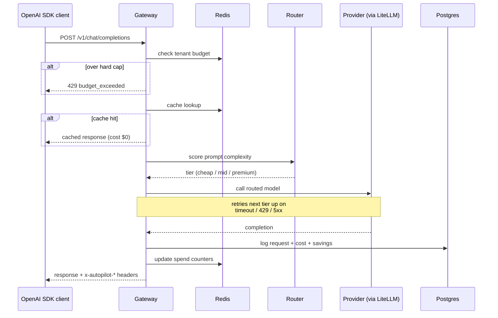
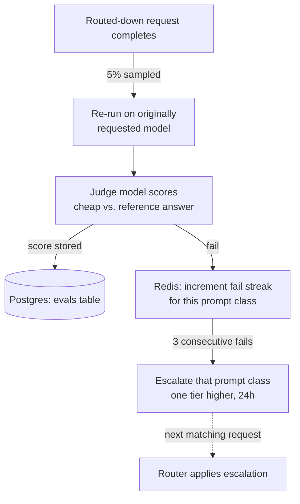
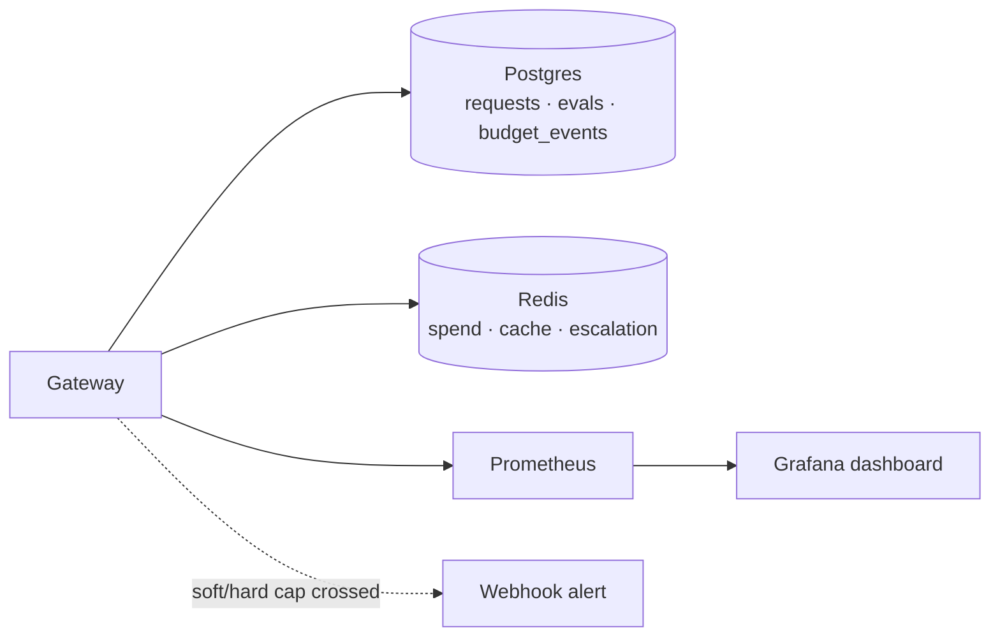

# LLM Cost Autopilot

An OpenAI-compatible LLM gateway that cuts inference spend automatically. It scores every
prompt for complexity, routes easy prompts to cheap models and hard prompts to capable
ones, enforces per-tenant budgets, and proves with an LLM judge that quality didn't drop.

It's a drop-in proxy: point any OpenAI SDK at it, change nothing else in your app.

## Results

Real end-to-end run, 100 unique prompts, real inference (local models standing in for
cost tiers, cloud-equivalent pricing applied), each prompt answered twice — once forced
to the top-tier model (baseline), once through the router (autopilot):

| Metric | Baseline (always top-tier) | Autopilot |
| --- | --- | --- |
| Total cost | $3.9091 | **$0.0640** |
| **Savings** | — | **$3.8452 (98.4%)** |
| **Judge-scored quality pass rate** | 100% (reference) | **80.0%** (50 judged) |
| p50 latency | 6146 ms | **282 ms** |
| p95 latency | 18090 ms | 4959 ms |
| Errors | 0 | 0 |

Routing split: 72% cheap tier, 8% mid tier, 20% premium tier — the router correctly
identified the genuinely hard prompts and still used the expensive model for those.

Full methodology and a second 500-prompt run in [BENCHMARK.local.md](BENCHMARK.local.md)
and [BENCHMARK.md](BENCHMARK.md). Reproduce it yourself — see [Benchmarking](#benchmarking)
below; it costs nothing to run, no cloud API key required.

## Architecture

**Request pipeline** — what happens to every `/v1/chat/completions` call:



**Feedback loop** — how the system checks and corrects its own quality:



**Observability:**



## Quickstart

Requires [Docker](https://docs.docker.com/get-docker/).

**1. Clone the repo:**

```bash
git clone https://github.com/omkar-ramesh/llm-cost-autopilot.git
cd llm-cost-autopilot
```

**2. Start the stack** (mock mode — no provider API key needed):

```bash
MOCK_PROVIDERS=true make up
```

<details>
<summary>Windows (PowerShell) equivalent</summary>

```powershell
$env:MOCK_PROVIDERS="true"
docker compose up --build -d
```
</details>

This starts the API (`:8000`), Postgres, Redis, Prometheus (`:9090`), and Grafana (`:3000`).
First run pulls Docker images and takes a minute or two — wait for it to finish before the
next step. Check it's ready:

```bash
curl localhost:8000/healthz
# {"status":"ok"}
```

If that fails, containers are probably still starting — wait a few seconds and retry, or
check with `docker compose ps` (all should say "healthy" or "Up").

**3. Send a request:**

```bash
curl localhost:8000/v1/chat/completions \
  -H "Authorization: Bearer sk-autopilot-dev" \
  -H "Content-Type: application/json" \
  -d '{"model":"claude-opus-5","messages":[{"role":"user","content":"hello"}]}'
```

The request asked for `claude-opus-5`, but the response headers show it was actually
answered by `gpt-4o-mini` — because the prompt scored as trivial:

```
x-autopilot-model: gpt-4o-mini
x-autopilot-tier: cheap
x-autopilot-complexity: 0.0002
x-autopilot-cost-usd: 0.00000735
x-autopilot-savings-usd: 0.00090765
```

Open [localhost:3000](http://localhost:3000) for the Grafana dashboard (no login required).

## Benchmarking

`scripts/benchmark.py` replays a mixed workload (50% easy / 30% medium / 20% hard prompts)
against a pinned top-tier baseline and the router, then reports cost, savings, judge-scored
quality, and latency.

**Option A — mock mode** (instant, no cost, routing/pricing logic only, not real inference):

```bash
make bench
```

**Option B — real local models** (free, real inference, real latency and quality numbers —
what produced the results above). Requires [Ollama](https://ollama.com):

```bash
ollama pull qwen2.5:3b qwen2.5:14b qwen2.5-coder:32b   # cheap / mid / premium stand-ins
ROUTING_CONFIG_PATH=config/routing.local.yaml MOCK_PROVIDERS=false uvicorn app.main:app &
BENCH_JUDGE_MODEL=ollama/qwen2.5-coder:32b python scripts/benchmark.py --n 100 --real
```

**Option C — real cloud providers** (costs real money, most representative numbers):

```bash
OPENAI_API_KEY=... ANTHROPIC_API_KEY=... BENCH_JUDGE_MODEL=gpt-4o \
  python scripts/benchmark.py --real
```

## Routing

Each prompt gets a heuristic complexity score (0-1) from a single pure function — prompt
length, code/math/JSON-schema/tool signals, multi-step language, turn count, and system
prompt size. The score picks a tier: `cheap` (score ≤0.35), `mid` (≤0.70), `premium`
(above). On a timeout, 429, or 5xx, the request falls back *up* the chain instead of
failing outright.

Callers can steer routing per request:

| Header | Effect |
| --- | --- |
| `x-autopilot-mode: cheap\|balanced\|quality` | Force cheapest tier, score-based (default), or force premium |
| `x-autopilot-model: <model>` | Pin an exact model and skip routing entirely |

Tiers, prices, thresholds, and the judge model are configured in
[config/routing.yaml](config/routing.yaml).

## Quality guard

A sampled share of routed-down requests (5% by default) is re-run on the originally
requested model and scored by a judge model (LLM-as-judge, 0-1 scale). Scores are stored
per-request in the `evals` table. After 3 consecutive failures, that class of prompt
(e.g. `code:long`) is automatically routed one tier higher for 24 hours.

```bash
curl localhost:8000/v1/autopilot/quality -H "Authorization: Bearer sk-autopilot-dev"
```

Shadow-eval spend is tracked separately from routing savings
(`autopilot_shadow_eval_cost_usd_total`), so the cost of proving quality is never
mistaken for savings.

## Budgets

Every API key carries a daily and monthly spend budget, tracked in Redis. At 80% of
budget the gateway fires one alert per window (set `ALERT_WEBHOOK_URL` for Slack or any
webhook) and forces the cheapest tier; at 100% it returns `429` with a structured
`budget_exceeded` error body.

Admin endpoints (guarded by an `x-admin-token` header, `ADMIN_TOKEN` env var, default
`admin-dev-token`) manage tenants and keys:

```bash
curl -X POST localhost:8000/v1/admin/tenants \
  -H "x-admin-token: admin-dev-token" -H "Content-Type: application/json" \
  -d '{"name":"acme"}'

curl -X POST localhost:8000/v1/admin/keys \
  -H "x-admin-token: admin-dev-token" -H "Content-Type: application/json" \
  -d '{"tenant_id":1,"daily_budget_usd":25,"monthly_budget_usd":500}'
```

`GET /v1/admin/tenants/{id}/spend` reports live spend; `PATCH /v1/admin/keys/{id}/budget`
updates a key's budget or deactivates it.

## Caching

Exact-match response cache in Redis, keyed on the semantic request fields **and the model
that actually answered** — so a `quality`-mode request is never served a cheap model's
cached answer for the same prompt. Streaming and non-deterministic requests
(`temperature > 0`, `n > 1`) bypass the cache. A Redis outage degrades to a cache miss,
never an error.

## Dashboard

Grafana at [localhost:3000](http://localhost:3000) auto-provisions the
**LLM Cost Autopilot** dashboard: spend and savings totals, spend per hour by model,
token throughput, p50/p95 latency, shadow-eval pass rate and cost, tier escalations,
and budget cap events.

## Tech stack


| Layer | Choice | Why |
| --- | --- | --- |
| Language | Python 3.12 | — |
| Web framework | FastAPI + Uvicorn | Async, OpenAPI schema for free, dependency injection for auth/session |
| LLM provider abstraction | [LiteLLM](https://github.com/BerriAI/litellm) | One interface over OpenAI, Anthropic, Ollama, and 100+ providers |
| Database | PostgreSQL + SQLModel | Source of truth for requests, evals, budget events |
| Cache / counters | Redis | Spend counters, response cache, escalation state — all need atomic, fast reads/writes |
| Metrics | Prometheus | Standard `/metrics` scrape target |
| Dashboard | Grafana | Auto-provisioned on startup, no manual setup |
| Containerization | Docker + Docker Compose | One-command `make up` for the whole stack |
| Testing | pytest — 127 tests, every provider call mocked | Nothing in CI touches a real API or costs money |
| Linting | ruff | Fast, single tool for style + import sorting |

## Development

```bash
pip install -e ".[dev]"
make test        # pytest, 127 tests
make lint        # ruff
```

Every test mocks the provider call — nothing in the test suite hits a real API.

## Project structure

```
app/
  main.py       FastAPI app, routes
  gateway.py    request pipeline orchestration
  router.py     complexity scoring + tier selection + fallback chain
  budget.py     Redis-backed spend counters, soft/hard cap enforcement
  quality.py    shadow eval, LLM-as-judge, tier escalation
  cache.py      Redis exact-match response cache
  admin.py      tenant/key/budget admin API
  pricing.py    per-model cost calculation
  metrics.py    Prometheus counters and histograms
  models.py     SQLModel tables
config/
  routing.yaml       tiers, prices, judge config (cloud providers)
  routing.local.yaml tiers pointed at local Ollama models, for free benchmarking
  grafana/           provisioned dashboard + datasource
scripts/
  benchmark.py  replays a mixed workload, writes a cost/quality/latency report
tests/          127 tests, one file per module
```
