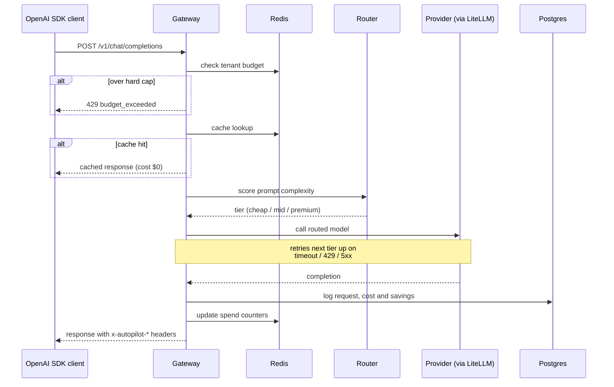
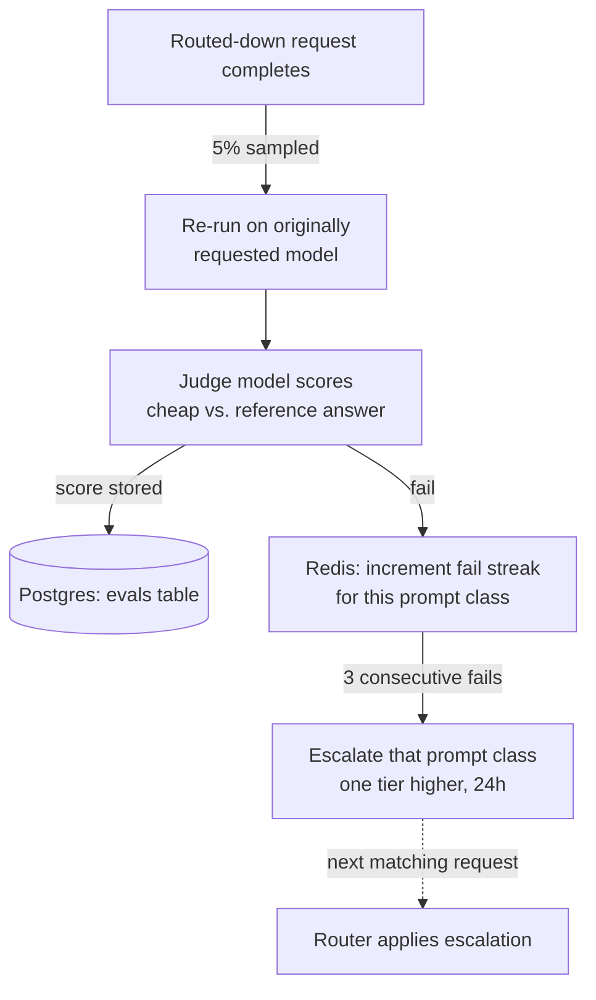
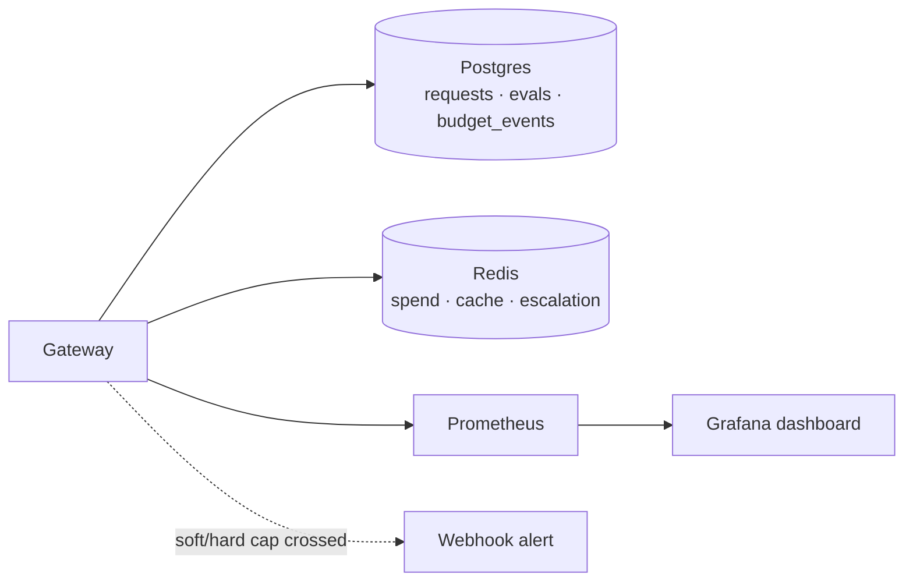

# LLM Cost Autopilot

An OpenAI-compatible LLM gateway that reduces inference spend automatically. It scores
every prompt for complexity, routes simple prompts to cheaper models and difficult
prompts to more capable ones, enforces per-tenant budgets, and uses an LLM judge to
confirm that answer quality has not declined.

It is a drop-in proxy. Point any OpenAI SDK at it, and nothing else in your application
needs to change.

## Results

The following is a real end-to-end run of 100 unique prompts, using real inference
(local models standing in for the cost tiers, with cloud-equivalent pricing applied).
Each prompt was answered twice: once forced to the top-tier model as a baseline, and
once through the router.

| Metric | Baseline (always top-tier) | Autopilot |
| --- | --- | --- |
| Total cost | $3.9091 | **$0.0640** |
| **Savings** | — | **$3.8452 (98.4%)** |
| **Judge-scored quality pass rate** | 100% (reference) | **80.0%** (50 judged) |
| p50 latency | 6146 ms | **282 ms** |
| p95 latency | 18090 ms | 4959 ms |
| Errors | 0 | 0 |

The routing split was 72% cheap tier, 8% mid tier, and 20% premium tier. The router
correctly identified the genuinely difficult prompts and still used the expensive model
for those.

The full methodology, along with a second 500-prompt run, is documented in
[BENCHMARK.local.md](BENCHMARK.local.md) and [BENCHMARK.md](BENCHMARK.md). See
[Benchmarking](#benchmarking) below to reproduce it. It costs nothing to run and requires
no cloud API key.

## Architecture

**Request pipeline.** What happens on every call to `/v1/chat/completions`:



**Feedback loop.** How the system checks and corrects its own quality:



**Observability.**



## Quickstart

Requires [Docker](https://docs.docker.com/get-docker/).

**1. Clone the repository:**

```bash
git clone https://github.com/omkar-ramesh/llm-cost-autopilot.git
cd llm-cost-autopilot
```

**2. Start the stack** (mock mode, no provider API key needed):

```bash
MOCK_PROVIDERS=true make up
```

<details>
<summary>Windows (PowerShell) equivalent</summary>

```powershell
$env:MOCK_PROVIDERS="true"
docker compose up --build -d
```
</details>

This starts the API (`:8000`), Postgres, Redis, Prometheus (`:9090`), and Grafana
(`:3000`). The first run pulls Docker images and can take a minute or two, so wait for it
to finish before continuing. Check that it is ready:

```bash
curl localhost:8000/healthz
# {"status":"ok"}
```

If this fails, the containers are likely still starting. Wait a few seconds and retry, or
check `docker compose ps` (everything should read "healthy" or "Up").

**3. Send a request:**

```bash
curl localhost:8000/v1/chat/completions \
  -H "Authorization: Bearer sk-autopilot-dev" \
  -H "Content-Type: application/json" \
  -d '{"model":"claude-opus-5","messages":[{"role":"user","content":"hello"}]}'
```

The request asked for `claude-opus-5`, but the response headers show it was actually
answered by `gpt-4o-mini`, because the prompt scored as trivial:

```
x-autopilot-model: gpt-4o-mini
x-autopilot-tier: cheap
x-autopilot-complexity: 0.0002
x-autopilot-cost-usd: 0.00000735
x-autopilot-savings-usd: 0.00090765
```

Open [localhost:3000](http://localhost:3000) for the Grafana dashboard. No login is
required.

## Benchmarking

`scripts/benchmark.py` replays a mixed workload (50% easy, 30% medium, 20% hard prompts)
against a pinned top-tier baseline and the router, then reports cost, savings,
judge-scored quality, and latency.

**Option A: mock mode.** Instant and free, but only exercises the routing and pricing
logic rather than real inference.

```bash
make bench
```

**Option B: real local models.** Free, with real inference, latency, and quality numbers.
This is what produced the results shown above. Requires [Ollama](https://ollama.com):

```bash
ollama pull qwen2.5:3b qwen2.5:14b qwen2.5-coder:32b   # cheap / mid / premium stand-ins
ROUTING_CONFIG_PATH=config/routing.local.yaml MOCK_PROVIDERS=false uvicorn app.main:app &
BENCH_JUDGE_MODEL=ollama/qwen2.5-coder:32b python scripts/benchmark.py --n 100 --real
```

**Option C: real cloud providers.** The most representative numbers, at real cost:

```bash
OPENAI_API_KEY=... ANTHROPIC_API_KEY=... BENCH_JUDGE_MODEL=gpt-4o \
  python scripts/benchmark.py --real
```

## Routing

Each prompt receives a heuristic complexity score between 0 and 1, computed by a single
pure function that considers prompt length, code, math, JSON-schema and tool-use signals,
multi-step language, turn count, and system prompt size. The score determines a tier:
`cheap` for a score of 0.35 or below, `mid` up to 0.70, and `premium` above that. On a
timeout, a 429, or a 5xx, the request falls back to the next tier up rather than failing
outright.

Callers may override routing per request using headers:

| Header | Effect |
| --- | --- |
| `x-autopilot-mode: cheap\|balanced\|quality` | Forces the cheapest tier, uses the score-based default, or forces premium |
| `x-autopilot-model: <model>` | Pins an exact model and skips routing entirely |

Tiers, prices, thresholds, and the judge model are all configured in
[config/routing.yaml](config/routing.yaml).

## Quality guard

A sampled share of routed-down requests, 5% by default, is re-run on the originally
requested model and scored by a judge model on a 0 to 1 scale. Scores are stored per
request in the `evals` table. After three consecutive failures, that class of prompt
(for example, `code:long`) is automatically routed one tier higher for 24 hours.

```bash
curl localhost:8000/v1/autopilot/quality -H "Authorization: Bearer sk-autopilot-dev"
```

Shadow-evaluation spend is tracked separately from routing savings
(`autopilot_shadow_eval_cost_usd_total`), so the cost of verifying quality is never
mistaken for savings.

## Budgets

Every API key carries a daily and a monthly spend budget, tracked in Redis. At 80% of
budget, the gateway fires one alert per window (set `ALERT_WEBHOOK_URL` for Slack or any
other webhook) and forces the cheapest tier. At 100%, it returns a `429` with a
structured `budget_exceeded` error body.

Admin endpoints, guarded by an `x-admin-token` header (`ADMIN_TOKEN` environment
variable, defaulting to `admin-dev-token`), manage tenants and keys:

```bash
curl -X POST localhost:8000/v1/admin/tenants \
  -H "x-admin-token: admin-dev-token" -H "Content-Type: application/json" \
  -d '{"name":"acme"}'

curl -X POST localhost:8000/v1/admin/keys \
  -H "x-admin-token: admin-dev-token" -H "Content-Type: application/json" \
  -d '{"tenant_id":1,"daily_budget_usd":25,"monthly_budget_usd":500}'
```

`GET /v1/admin/tenants/{id}/spend` reports live spend. `PATCH /v1/admin/keys/{id}/budget`
updates a key's budget or deactivates it.

## Caching

An exact-match response cache in Redis is keyed on the semantic request fields and the
model that actually answered, so a `quality`-mode request is never served a cheap model's
cached answer for the same prompt. Streaming and non-deterministic requests
(`temperature > 0`, `n > 1`) bypass the cache. A Redis outage degrades to a cache miss
rather than an error.

## Dashboard

Grafana, available at [localhost:3000](http://localhost:3000), automatically provisions
the "LLM Cost Autopilot" dashboard: spend and savings totals, spend per hour by model,
token throughput, p50 and p95 latency, shadow-evaluation pass rate and cost, tier
escalations, and budget cap events.

## Tech stack


| Layer | Choice | Reason |
| --- | --- | --- |
| Language | Python 3.12 | — |
| Web framework | FastAPI and Uvicorn | Asynchronous, generates an OpenAPI schema for free, and provides dependency injection for auth and sessions |
| LLM provider abstraction | [LiteLLM](https://github.com/BerriAI/litellm) | A single interface over OpenAI, Anthropic, Ollama, and more than 100 other providers |
| Database | PostgreSQL with SQLModel | The source of truth for requests, evaluations, and budget events |
| Cache and counters | Redis | Spend counters, the response cache, and escalation state all need atomic, low-latency reads and writes |
| Metrics | Prometheus | A standard `/metrics` scrape target |
| Dashboard | Grafana | Automatically provisioned on startup, with no manual setup required |
| Containerization | Docker and Docker Compose | Allows the entire stack to start with a single `make up` command |
| Testing | Pytest, 127 tests, every provider call mocked | Nothing in the test suite touches a real API or incurs cost |
| Linting | Ruff | A single, fast tool for style and import sorting |

## Development

```bash
pip install -e ".[dev]"
make test        # pytest, 127 tests
make lint        # ruff
```

Every test mocks the provider call. Nothing in the test suite calls a real API.

## Project structure

```
app/
  main.py       FastAPI app, routes
  gateway.py    request pipeline orchestration
  router.py     complexity scoring, tier selection and fallback chain
  budget.py     Redis-backed spend counters, soft and hard cap enforcement
  quality.py    shadow evaluation, LLM-as-judge, tier escalation
  cache.py      Redis exact-match response cache
  admin.py      tenant, key and budget admin API
  pricing.py    per-model cost calculation
  metrics.py    Prometheus counters and histograms
  models.py     SQLModel tables
config/
  routing.yaml       tiers, prices and judge configuration (cloud providers)
  routing.local.yaml tiers pointed at local Ollama models, for free benchmarking
  grafana/           provisioned dashboard and datasource
scripts/
  benchmark.py  replays a mixed workload and writes a cost, quality and latency report
tests/          127 tests, one file per module
```
