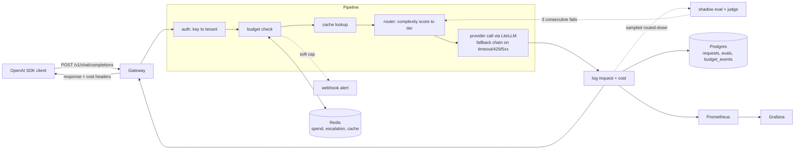

# LLM Cost Autopilot

An OpenAI-compatible gateway that cuts LLM spend automatically: it scores every prompt,
routes the easy ones to cheaper models, enforces per-tenant budgets, and proves with a
judge model that quality did not drop.

Drop-in: point any OpenAI SDK at it and change nothing else.

## Benchmark

500-prompt mixed workload (250 easy / 150 medium / 100 hard), each prompt replayed twice —
once pinned to `claude-opus-5`, once through the router:

| Metric | Baseline (always `claude-opus-5`) | Autopilot |
| --- | --- | --- |
| Total cost | $1.2649 | **$0.1368** |
| Savings | — | **89.2%** |
| Routing | 100% premium | 73% cheap, 27% mid |
| Errors | 0 | 0 |

These figures come from `make bench` in **mock mode**: the routing decisions and the price
table are real, but mock completions are a fixed ~12 tokens, so the dollar amounts are not a
production measurement. See [BENCHMARK.md](BENCHMARK.md) for the full caveat, and run
`python scripts/benchmark.py --real` with provider keys for quotable latency and quality
numbers.

## Architecture



## Quickstart

```bash
make up          # api :8000, postgres, redis, prometheus :9090, grafana :3000
curl localhost:8000/healthz
```

```bash
curl localhost:8000/v1/chat/completions \
  -H "Authorization: Bearer sk-autopilot-dev" \
  -H "Content-Type: application/json" \
  -d '{"model":"claude-opus-5","messages":[{"role":"user","content":"hello"}]}'
```

That request asks for `claude-opus-5` and is answered by `gpt-4o-mini`, because the prompt
scores as trivial. The response headers say so:

```
x-autopilot-model: gpt-4o-mini
x-autopilot-tier: cheap
x-autopilot-complexity: 0.0002
x-autopilot-cost-usd: 0.00000735
x-autopilot-savings-usd: 0.00090765
```

Set `MOCK_PROVIDERS=true` to run the whole stack without provider API keys.

```bash
make bench       # replays the benchmark workload, writes BENCHMARK.md
```

## Routing

Each prompt gets a heuristic complexity score (0–1) from a single pure function — prompt
length, code/math/JSON-schema/tool signals, multi-step language, turn count and system
prompt size. The score picks a tier: `cheap` (≤0.35), `mid` (≤0.70), `premium`. On a
timeout, 429 or 5xx the request falls back *up* the chain rather than failing.

Callers can steer per request:

| Header | Effect |
| --- | --- |
| `x-autopilot-mode: cheap\|balanced\|quality` | Force cheapest tier, score-based (default), or premium |
| `x-autopilot-model: <model>` | Pin an exact model and skip routing |

Tiers, prices, thresholds and the judge live in [config/routing.yaml](config/routing.yaml).

## Quality guard

A sampled share of routed-down requests (5% by default) is re-run on the originally
requested model and scored by a judge model. Scores land in the `evals` table; after 3
consecutive failures a prompt class (e.g. `code:long`) is routed one tier higher for 24h.

```bash
curl localhost:8000/v1/autopilot/quality -H "Authorization: Bearer sk-autopilot-dev"
```

Shadow-eval spend is tracked separately (`autopilot_shadow_eval_cost_usd_total`) so the
cost of proving quality is never mistaken for savings.

## Budgets

Each API key carries a daily and monthly budget, counted in Redis. At 80% the gateway
alerts once per window (set `ALERT_WEBHOOK_URL` for Slack or any webhook) and forces the
cheapest tier; at 100% it returns `429` with a `budget_exceeded` body.

Admin endpoints are guarded by `x-admin-token` (`ADMIN_TOKEN`, default `admin-dev-token`):

```bash
curl -X POST localhost:8000/v1/admin/tenants \
  -H "x-admin-token: admin-dev-token" -H "Content-Type: application/json" \
  -d '{"name":"acme"}'

curl -X POST localhost:8000/v1/admin/keys \
  -H "x-admin-token: admin-dev-token" -H "Content-Type: application/json" \
  -d '{"tenant_id":1,"daily_budget_usd":25,"monthly_budget_usd":500}'
```

`GET /v1/admin/tenants/{id}/spend` reports live spend; `PATCH /v1/admin/keys/{id}/budget`
updates budgets or deactivates a key.

## Caching

Exact-match response cache in Redis, keyed on the semantic request fields **and the model
that answered** — so a `quality` request is never served an answer a cheap model produced.
Streaming and non-deterministic requests (`temperature > 0`, `n > 1`) bypass it. A cache
outage degrades to a miss, never an error. The `get`/`set` interface is deliberately narrow
so a semantic cache can replace the backend without touching the pipeline.

## Dashboard

Grafana at [localhost:3000](http://localhost:3000) (anonymous viewer) auto-provisions the
**LLM Cost Autopilot** dashboard: spend and savings totals, spend per hour by model, tokens,
p50/p95 latency, shadow-eval pass rate and cost, tier escalations, and budget cap events.

## Development

```bash
pip install -e ".[dev]"
make test        # pytest
make lint        # ruff
```

Provider calls are mocked in every test; nothing in CI touches a real API.
